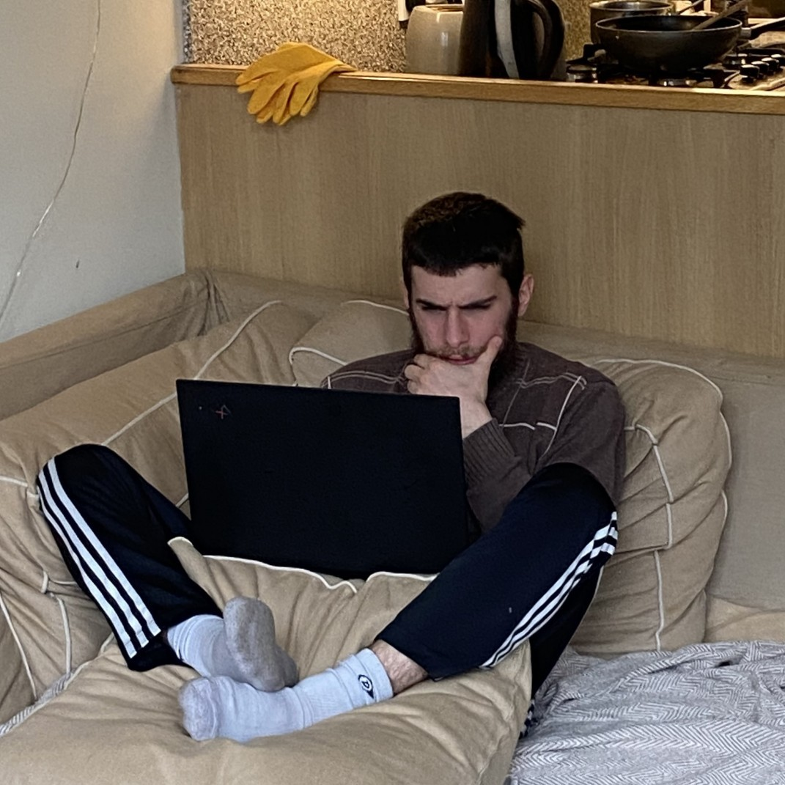

<!-- --- -->
<!-- hide: -->
<!--   - navigation -->
<!--   - toc -->
<!-- --- -->

# About

<!-- TODO: better photo: something techy -->
{ align=left width=250 }

Hi :wave:, I'm Nathan, an aspiring wizard from the UK and I write about fun things like the future of computing. 

<!-- Right now I'm working on  -->

<!-- I love -->

<!-- I'm Nathan and I'm SHHTINKY -->

<!-- ideas -->
<!-- building things -->
<!-- intelligence  -->
<!-- the future of technology and humanity  -->
<!-- and I like to write about the future. -->

<!-- Hacker/Builder -->
<!-- Data science -->
<!-- software -> hardware -->
<!-- Transhumanism  -->

<!-- Im currently interested in learning more about... -->

<!-- Knowledge graphs -->

<!-- Human and machine intelligence -->

<!-- ## Interests -->
<!-- - the future of computing -->
