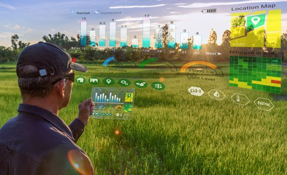

<!-- ? How to put Previous/Next at top (as well) -->
<!-- previous: [why xr headsets are the future of work™](../why_xr_computing_is_the_future_of_work) -->

# Does XR Need a New Keyboard? 
<!-- ALT: Does XR computing needs a new keyboard? -->

<!-- KEY TERMS? -->

*The year is 2027. You just got a new XR headset to replace your computer. Unlimited screen real estate in a distraction free realm. Or so you thought.* 
<!-- What more could you possibly want? -->
<!-- Exciting times! Praiseth be to Zuck. -->

<figure markdown>
  
  <figcaption>Your boundless XR workstation, until...</figcaption>
</figure>

Empowered by this expansive new computing paradigm, you stand up, ~~effortlessly able to continue your efforts~~.

!!! failure "Problem"

    Your keyboard is stuck on the desk.

How restraining.

<!-- ## ? The promise of XR -->
<!-- Benefits of XR HERE? -->

## Problem: The keyboard restricts XR
<!-- ALT: ## The bottleneck for XR computers  -->

<!-- XR promises a wider landscape of computing environments:  -->
XR means the freedom to take immersive computing anywhere: pace the room, roam out into nature, lie in bed or the comfiest of chairs; your cinematic information interface comes effortlessly with you.

<!-- TODO: change to collage? -->
<figure markdown>
  {width=600}
  <figcaption> XR computing outside on the farm </figcaption>
</figure>

XR "unlocks the map" for larger computer interfaces-- but here's the catch, as soon as you need a keyboard, you're tied to the desk (alternatively you may suffer the following torment).

<figure markdown> 
  {width=600}
  <figcaption> Current "state of the art" XR keyboard. So slow it's utterly unusable for non-trivial tasks. </figcaption>
</figure>

Next time you see a futuristic render of someone orchestrating a elaborately complex XR interface with their mere hands, ask yourself this:
when you use a computer, could you last a day, let alone an hour, working like this? or would you want a keyboard?

<figure markdown>
  {width=600}
  <figcaption> Cutting edge biology minus the keyboard. Pray nothing ever 
  needs searched up or written down.</figcaption>
</figure>

Though there are many cases where a touchscreen interface will do, for professional or otherwise performant computer use cases; such as writing documents, emails, or using specialist applications, keyboard presence is completely ubiquitous.
As XR grows to serve these use cases, it shall be strange that a floating 8k monitor comes everywhere with you, when a keyboard, a seemingly simpler device, can't.

<!-- TODO: pervasiveness -> range  -->
<!-- TODO: move text down and make key vertical -->
<figure markdown>
  {width=500}
  <figcaption> A bottleneck in XR computers: The stationary keyboard. </figcaption>
</figure>

<!-- With XR already beginning to serve these use cases, the sole bottle neck restricting movement and tying you to the desk is the keyboard. -->

<!-- As XR grows to serve these use cases, ... -->
<!-- the only thing holding you back from fluidity in this extended computational world.  -->
<!-- they keyboard will be  -->

<!-- END THE ARTICLE HERE?! -->

<!-- Worse, its likely that these are the use cases that will *need* XR. -->

 
<!-- 
 -->
<!--    -->
<!--     <i>"This is bigger and centred text, lets put a nice little quote here for our lovely readers. But what about my magic bean and line overflow?"</i> -->
<!--    -->
<!-- 
 -->

<!-- Movement is not some future luxury, the human body is designed to be in constant motion and  -->

<!-- <figure markdown> -->
<!--   {width=600} -->
<!--   <figcaption> Evolution of a human's working posture. Can this be reversed? </figcaption> -->
<!-- </figure> -->

<!-- The computer desk is linked with  -->

<!-- and too much time sitting at a computer desk leads to predictable deterioration in posture, mobility, mortality and cognition; the shocking extent of which we cover in our [previous post in the series]:  -->

<!-- "As many as 60% of computer-using professionals are expected to suffer debilitating RSI at some point their career (CITE) ...  one study suggested that sitting for as little as 3 hours a day reduced average life expectancy by 2 years" -->
<!-- it is a cornerstone of health and cognition. -->

<!-- In opposition, are the [extraordinary physical and cognitive benefits of movement and the outdoors]. -->

<!-- ??? note "A hope of XR: A return to locomotion" -->

<!--     <\!-- MAYBE FIGURE -\-> -->

<!--     <\!-- posture, mobility, mortality and cognition -\-> -->
<!--     That you assume sitting all day at a computer desk is satisfactory, is an exemplar specimen of status quo bias. -->
<!--     Given free realm to move ones arms, stand up, and wander around (whilst maintaining working capability), you will, --just as humans have done in the past-- because that's our nature. -->

<!--     Against the grain of human nature, -->
<!--     the stationary desk is a direct product of the stationary computer and its towering civilisational function. -->
<!--     As the opportunity presents itself for the computer to become wearable, you would be mistaken for thinking this inconsequential. -->

<!--     Contrary to the fear that VR will take us away from the real world, a major hope of XR computing is that it will return us to the *locomotion lifestyle* of our hunter-gatherer heritance: increasing time spent outdoors and moving our body in natural ways. -->
<!--     As long as the stationary keyboard persists, we remain tied to the desk and this freedom cannot be fully realised. -->

<!-- ## Movement and the stationary desk -->
<!-- ## The stationary desk and the human condition -->
<!-- ## human nature and the stationary desk -->

## Solution: XR needs a new keyboard
XR is calling out for a new keyboard --or keyboard like device-- that matches the working range of the headset it will accompany. 
This problem is obvious for anyone that *actually tries* to use a XR headset as a computer. 

Take [SimulaVR](https://simulavr.com), a company building the first VR linux workstation. They have ran into this problem in practice and implemented the first a improvised solution, the 'Keyboard Apron'.
 
<figure markdown>
  {width=700}
  <figcaption> SimulaVR demonstration. From left: sitting away from desk (keyboard not ideal), lying in bed (keyboard not practical), standing (keyboard not possible; hence apron innovation). <a href="https://twitter.com/georgewsinger/status/1507840684556009478?cxt=HHwWjIC-zaPH9uwpAAAA">[source]</a> </figcaption>
</figure>

The Apron is an significant upgrade on the stationary, desk mounted keyboard, but not without flaws.
The arms are locked in a single (non-optimal) position, so cannot be combined with standard VR-controllers or gestures, not to mention, the setup is large and clunky.
It's a good hacky compromise, but not yet a truly native XR keyboard.

Elsewhere, the internet reveals a graveyard of past attempts at wearable keyboard tech, none of which quite made the cut as a mainstream keyboard replacement.
There was the 1992-2015 [twiddler](https://twiddler.tekgear.com), a chorded one-handed keyboard (still available today),
the 2005 [AlphaGrip](http://www.alphagrips.com), a gamecontroller-with-lots-of-extra-buttons shaped keyboard,
the 2015-present [Tap Strap](https://www.tapwithus.com), a web of rings that registers taps on a surface,
and the 2019 [CTRL-Labs writstband](https://www.curtisbarbre.com/ctrl-kit) (acquired by Meta/Facebook), which aimed to reconstruct gestures from electrical sensors on the wrist.

<figure markdown>
  {width=600}
  <figcaption> The wearable keyboard graveyard. Clockwise from top left: Twiddler3, AlphaGrip, CRTL-Labs wristband, Tap Strap. </figcaption>
</figure>

Having gone to great lengths to acquire and test them all, one shared weakness is certainly uncomfortable ergonomics and bad (or nonexistent) tactile feedback. 
Another common weakness is the keymaps: all are non-standard, so have a steep learning curve (weeks if not months of painstaking training), and all result in a considerably lower WPM than a standard keyboard; a bitter pill for all, and dealbreaker for many if not most.

This gives some direction to what a viable wearable keyboard might look like: comfortable ergonomics & tactile feedback, with a low learning curve (close to standard layout) & fast WPM.

<!-- It is why previous solutions have failed to feel inspiring   -->
<!-- engineering complexity of the task at hand. in particular hand ergonomics with lots of buttons... -->
<!-- a better solutions might now be available due to consumer 3D printing (better fit ergonomics) and the rise of XR (impetus) -->

<!-- None are entirely satisfactory. -->

<!-- !!! question -->

<!--     Why haven't the big tech companies developing XR technology been working on wearable keyboard input. -->

<!-- How does this problem get resolved? -->
<!-- We see three possibilities, either:  -->

<!-- 1. (It doesn't) Keyboard usage restrains XR mobility indefinitely.  -->
<!-- 3. XR evolves into a keyboardless computing environment. -->
<!-- 2. We get a new, XR friendly, portable/wearable keyboard. -->

<!-- (1) [as laid out](#problem-stationary-keyboards-restrict-xr) is unstable, people will natrually want (3). -->

<!-- (2) is patently naive, a need for what the keyboard provides: fast text and symbolic input, cannot be made be redundant in the XR computing platform, certainly not in the foreseeable future.  -->
<!-- People will continue to want to edit documents, emails, spreadsheets, code and use keyboard shortcuts-- task which are clunky using alternatives such as touchscreens or voice assistants.  -->
  
<!-- (3) is ideal, solving the problem. -->

<!-- Interestingly, leading XR platforms do not seem to be urgently pursuing (3). -->

<!-- ## Features of a good XR keyboard -->
<!-- Lets distil a practical checklist of features for a XR-suitable keyboard from our findings: -->

<!-- 1. *Wearable* :: Having a working range comparable to the headset it accompanies. -->

<!-- 2. *Fast enough* :: Input should be as fast/effective as a standard keyboard (or users will be torn). -->

<!-- 3. *Available soon (1-2 years)* :: XR headsets are already arriving. -->

<!-- 4. *Familiar keymap (QWERTY)* :: Not offering a familiar keymap would be very limiting. Many previous pioneering keymaps have failed to catch on.  -->

<!-- 4. *Ergonomic* : Should feel natural to use and not cause strain/RSI. -->

<!-- ## What is currently available -->
<!-- Lets research what existing solutions there are and how they match up to our criteria. -->

<!-- | Name                  | Image                              | Notes                                                                                                                                                                      | -->
<!-- |-----------------------|------------------------------------|----------------------------------------------------------------------------------------------------------------------------------------------------------------------------| -->
<!-- | Standard keyboard     |        | The problem. Not well suited for wearable XR computing.                                                                                                                    | -->
<!-- | VR on screen keyboard |      | Current 'state of the art'. Does not have the bandwidth capacity for general-purpose text/symbolic input, hence unusable for serious work. Swipe might be slightly better. | -->
<!-- | Twiddler 3 (2014)     |         | Wearable, and purchasable. However suffers from poor ergonomics and a relatively slow and highly unfamiliar keymap.                                                        | -->
<!-- | Tap Strap (2018)      |       | Not familiar or fast enough to replace the keyboard.                                                                                                                       | -->
<!-- | EMG wristband         |    | Experimental input device not yet functional. Unlikely to be ready[^2] before XR takes off as a mainstream computing platform.                                             | -->
<!-- | Keyboard Apron        |  | Simple hack in the right direction using split ergonomic keyboard. However movement is still limited and must switch between this and handheld controllers.                | -->
<!-- | Typeware              |    | Pre-seed start up building a handheld keyboard + mouse.                                                                                                                    | -->

<!-- [^2]: cite zuckerberg article 5 years away 5 years ago, now 5 years away. -->

<!-- ## Why is no one building this? -->

<!-- Lazily assuming (1) will be enough or that (2) is possible. -->
<!-- instead of developing new technology -->

<!-- - Meta is highly influential -->
<!-- - iPadification Fallacy -->
<!-- - lazy option, new hardware/devoces is hard -->

<!-- Meta, currently the biggest player in this space, is marketing XR foremostly as a social-interactive entertainment metaverse, generally devoid of 1st class desktop functionality (and hence keyboard input)-- and many others are following suit. -->

<!-- Some rudimentary attempts have been made (SimulaVR keyboard aperon) ...  -->

<!-- - lazy solutions -->
<!-- - undervalue the keyboard -->
<!-- - don't really believe it will replace the desktop  -->
<!-- - lack of foresight? -->

<!-- have tended to underestimate the value proposition of (2), lazily assuming the suboptimal solutions (1) and/or (3). -->

<!-- This is one face of the broader iPadification fallacy, responsible for the in-vogue attempt to build XR computers devoid of serious symbolic input, instead with only mobile-esque pointing devices. -->

<!-- - ... the in-vogue (narrower) outlook of XR as a social-interactive entertainment metaverse of 3D virtual objects -->

<!-- What is crazy is that despite this, (2) seems currently be the assumed logic of XR computing platforms under development  -->

<!-- text and symbolic input/manipulation is core to human communication with computers.  -->

<!-- It is however worth noting because it currently seems to be the assumed logic of existing XR technologies.  -->

## Conclusion
We conclude that,
(1) the standard keyboard is not suitable for XR (moving, getting comfy, going outside) due to its lack of mobility,
(2) it is a convenient fiction that computers will be entirely, or even largely, operable without keyboards in the near future,
(3) hence, XR computers are hamstrung by the lack of a viable keyboard, 
and so finally, (4) yes, XR needs a new keyboard-- wearable computers need wearable input.

What exact form this will take is not yet clear, say for example, how much will such a device resemble the current keyboard?
What I do know is that I want an XR computer and so I want this.
If no one else is going to build this, I might just do it myself.

<!-- Reach out to join the movement.  -->

<!-- So whilst billion in investment pours into XR computing.  -->

<!-- a major XR workflow: moving, getting comfy, going outside, etc. is -->

<!-- conclusion -->

<!-- for XR to really be used as a computer, it will need a wearable new keyboard.    -->

<!-- The keyboard is a relic of the desktop computing paradigm, it is stationary only because the desktop was itself so. -->

<!-- The computer desk will not perish, but balance will be returned to the force. -->

<!-- ## Bonus: why nobody is building this -->
<!-- MAYBE: stupid quote form qualcomm guy -->
<!-- For the size of investment going into VR, I find it amazing how little attention there is on this issue -->

<!-- - The time is now.. -->

<!-- Pick your fighter... -->

<!-- === "Ditch the keyboard" -->

<!--     * on screen keyboard -->
<!--     * menus + voice + ai -->

<!--     <figure markdown> -->
<!--       {width=300} -->
<!--       <figcaption>VR keyboard</figcaption> -->
<!--     </figure> -->

<!-- === "EMG wrsitband" -->

<!--     1. Sed sagittis eleifend rutrum -->
<!--     2. Donec vitae suscipit est -->
<!--     3. Nulla tempor lobortis orci -->

<!-- === "Keyboard for XR" -->

<!-- ## Benefits -->
<!-- <\!-- ? MOVE: the promise of XR -\-> -->
<!-- - return outside -->
<!-- - prevent RSI -->
<!-- - embody cognition (move = think) -->
<!-- -   -->

<!-- ## Misconception: Point and click will be enough -->

<!-- Stockholm syndrome for the desk -->
<!-- ## (Bonus) Why nobody is building this  -->

