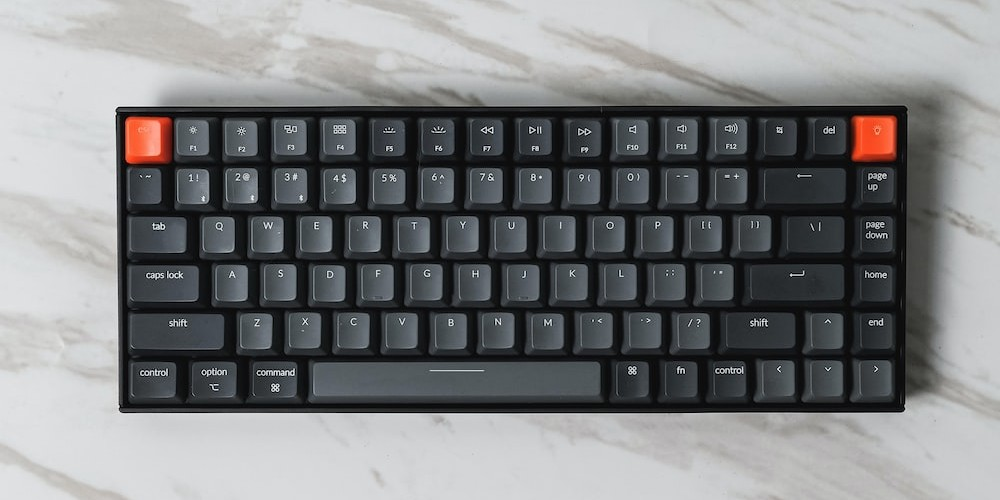
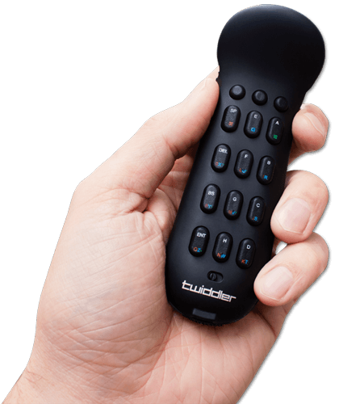
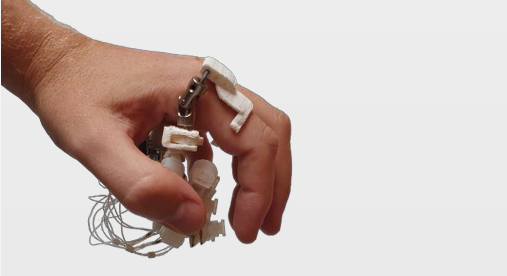

Previous: [Why XR Headsets are The Future of Work™](../why_XR_computing_is_the_future_of_work)

# Does XR Need a New Keyboard? [DRAFT] 
<!-- ALT: Does XR computing needs a new keyboard? -->

*The year is 2024. You just got a new VR/AR headset to replace your computer: unlimited screen real estate in a distraction free realm.
Exciting times! Praise be to Zuck.*

<figure markdown>
  
  <figcaption>Boundless XR workstation, until...</figcaption>
</figure>

Empowered by the freedom of this new computing paradigm (see: [previous post](why_XR_computing_is_the_future_of_work)), you stand up to pace the room, ~~effortlessly able to take your computing environment with you~~.

!!! failure "Problem"

    Your keyboard is stuck on the desk.

How restraining.

<!-- ## ? The promise of XR -->

## Problem: Keyboards restrict XR

<!-- MAYBE DIAGRAM: XR in nature -->

XR unlocks an expanded landscape of computing: pace around the room, roam out into nature, lie in bed or the comfiest of chairs; your infinite interface efforlessly with you.
But if you want a keyboard-- you're tied to the desk.
<!-- You can use VR/AR headset almost anywhere you go, -->

<figure markdown>
  {width=550 }
  <figcaption> XR unlocks the map of computing landscape. Holding it back: the stationary keyboard. </figcaption>
</figure>

A keyboard is not always needed; there being many applications where a point-and-click interface will do.
==However, among productivity/professional computer use cases, the keyboard is ubiquitous.
So, if XR grows to serve these use cases, the keyboard becomes this sole bottleneck withholding you from the extended computational world.==
When a floating 8k monitor comes everywhere with you, it will be strange that your keyboard, a seemingly simpler device, can't.

??? note "A hope of XR: The return of locomotion"

    <figure markdown>
      {width=600}
      <figcaption> Regressing evolution of a working human's posture </figcaption>
    </figure>

    Contary to the fear that VR will take us away from the real world, a major hope of XR computing is that it will return us to the *locomotion lifestyle* of our hunter-gatherer heritance: increasing time spent outdoors and moving our body in natural ways.
    As long as the stationary keyboard persists, we remain tied to the desk and this freedom cannot be fully realised.

## Movement and the stationary desk
<!-- ## The stationary desk and the human condition -->
<!-- ## human nature and the stationary desk -->

Movement is not some future luxury freedom, it is a cornerstone of health and cognition.
The human body is designed to be in motion, and too much time sitting at a computer desk leads to predictable deterioration in posture, mobility, mortality and cognition; the shocking extent of which we cover in our [previous post in the series]: "As many as 60% of computer-using professionals are expected to suffer debilitating RSI at some point their career (CITE) ...  one study suggested that sitting for as little as 3 hours a day reduced average life expectancy by 2 years"
In opposition, are the [extraordinary physical and cognitive benefits of movement and the outdoors].

<!-- MAYBE FIGURE -->

<!-- posture, mobility, mortality and cognition -->
That you assume sitting all day at a computer desk is satisfactory, is an exemplar specimen of status quo bias.
==Given free realm to move ones arms, stand up, and wander around (whilst maintaining working capability), you will, --just as humans have done in the past-- because that's our nature.==

Against the grain of human nature,
the stationary desk is a direct product of the stationary computer and its towering civilisational function.
As the opportunity presents itself for the computer to become wearable, you would be mistaken for thinking this inconsequential.

## Solution: XR needs a new keyboard
<!-- It might seem obvious that this XR needs a new keyboard,   -->

<!-- MAYBE: stupid quote form qualcomm guy -->

<!-- For the size of investment going into VR, I find it amazing how little attention there is on this issue -->

So it might be good if there was a keyboard that 

<!-- dont like this v -->
How does this problem get resolved?
We see three possibilities, either: 

1. (It doesn't) Keyboard usage restrains XR mobility indefinitely. 
3. XR evolves into a keyboardless computing environment.
2. We get a new, XR friendly, portable/wearable keyboard.

(1) [as laid out](#problem-stationary-keyboards-restrict-xr) is unstable, people will natrually want (3).

(2) is patently naive, a need for what the keyboard provides: fast text and symbolic input, cannot be made be redundant in the XR computing platform, certainly not in the foreseeable future. 
People will continue to want to edit documents, emails, spreadsheets, code and use keyboard shortcuts-- task which are clunky using alternatives such as touchscreens or voice assistants. 
  
(3) is ideal, solving the problem.

<!-- MOVE: up -->
Interestingly, leading XR platforms do not seem to be urgently pursuing (3).
Meta, currently the biggest player in this space, is marketing XR foremostly as a social-interactive entertainment metaverse, generally devoid of 1st class desktop functionality (and hence keyboard input)-- and many others are following suit.

## Features of a good XR keyboard
Lets distil a practical checklist of features for a XR-suitable keyboard from our findings:

1. *Wearable* :: Having a working range comparable to the headset it accompanies.

2. *Fast enough* :: Input should be as fast/effective as a standard keyboard (or users will be torn).

3. *Available soon (1-2 years)* :: XR headsets are already arriving.

4. *Familiar keymap (QWERTY)* :: Not offering a familiar keymap would be very limiting. Many previous pioneering keymaps have failed to catch on. 

4. *Ergonomic* : Should feel natural to use and not cause strain/RSI.

## What is currently available
Lets research what existing solutions there are and how they match up to our criteria.

| Name                  | Image                              | Notes                                                                                                                                                                      |
|-----------------------|------------------------------------|----------------------------------------------------------------------------------------------------------------------------------------------------------------------------|
| Standard keyboard     |        | The problem. Not well suited for wearable XR computing.                                                                                                                    |
| VR on screen keyboard |      | Current 'state of the art'. Does not have the bandwidth capacity for general-purpose text/symbolic input, hence unusable for serious work. Swipe might be slightly better. |
| Twiddler 3 (2014)     |         | Wearable, and purchasable. However suffers from poor ergonomics and a relatively slow and highly unfamiliar keymap.                                                        |
| Tap Strap (2018)      |       | Not familiar or fast enough to replace the keyboard.                                                                                                                       |
| EMG wristband         |    | Experimental input device not yet functional. Unlikely to be ready[^2] before XR takes off as a mainstream computing platform.                                             |
| Keyboard Apron        |  | Simple hack in the right direction using split ergonomic keyboard. However movement is still limited and must switch between this and handheld controllers.                |
| Typeware              |    | Pre-seed start up building a handheld keyboard + mouse.                                                                                                                    |

[^2]: cite zuckerberg article 5 years away 5 years ago, now 5 years away.

<!-- ## Why is no one building this? -->

<!-- Lazily assuming (1) will be enough or that (2) is possible. -->
<!-- instead of developing new technology -->

<!-- - Meta is highly influential -->
<!-- - iPadification Fallacy -->
<!-- - lazy option, new hardware/devoces is hard -->

Some rudimentary attempts have been made (SimulaVR keyboard aperon) ... 

<!-- - lazy solutions -->
<!-- - undervalue the keyboard -->
<!-- - don't really believe it will replace the desktop  -->
<!-- - lack of foresight? -->

<!-- have tended to underestimate the value proposition of (2), lazily assuming the suboptimal solutions (1) and/or (3). -->

<!-- This is one face of the broader iPadification fallacy, responsible for the in-vogue attempt to build XR computers devoid of serious symbolic input, instead with only mobile-esque pointing devices. -->

<!-- - ... the in-vogue (narrower) outlook of XR as a social-interactive entertainment metaverse of 3D virtual objects -->

<!-- What is crazy is that despite this, (2) seems currently be the assumed logic of XR computing platforms under development  -->

<!-- text and symbolic input/manipulation is core to human communication with computers.  -->

<!-- It is however worth noting because it currently seems to be the assumed logic of existing XR technologies.  -->

## Conclusion
XR needs a portable new keyboard.
What form this will takes is not clear, particularly how much such a device will resemble the current keyboard.
<!-- If you're not careful, I might just build one.  -->

The keyboard is a relic of the desktop computing paradigm, it is stationary only because the desktop was itself so.

In XR, a major workflow (moving, comfy and outside) is restricted

The computer desk will not perish, but balance will be returned to the force.

<!-- - The time is now.. -->

<!-- Pick your fighter... -->

<!-- === "Ditch the keyboard" -->

<!--     * on screen keyboard -->
<!--     * menus + voice + ai -->

<!--     <figure markdown> -->
<!--       {width=300} -->
<!--       <figcaption>VR keyboard</figcaption> -->
<!--     </figure> -->

<!-- === "EMG wrsitband" -->

<!--     1. Sed sagittis eleifend rutrum -->
<!--     2. Donec vitae suscipit est -->
<!--     3. Nulla tempor lobortis orci -->

<!-- === "Keyboard for XR" -->

<!-- ## Benefits -->
<!-- <\!-- ? MOVE: the promise of XR -\-> -->
<!-- - return outside -->
<!-- - prevent RSI -->
<!-- - embody cognition (move = think) -->
<!-- -   -->

<!-- ## Misconception: Point and click will be enough -->

<!-- Stockholm syndrome for the desk -->
<!-- ## (Bonus) Why nobody is building this  -->

