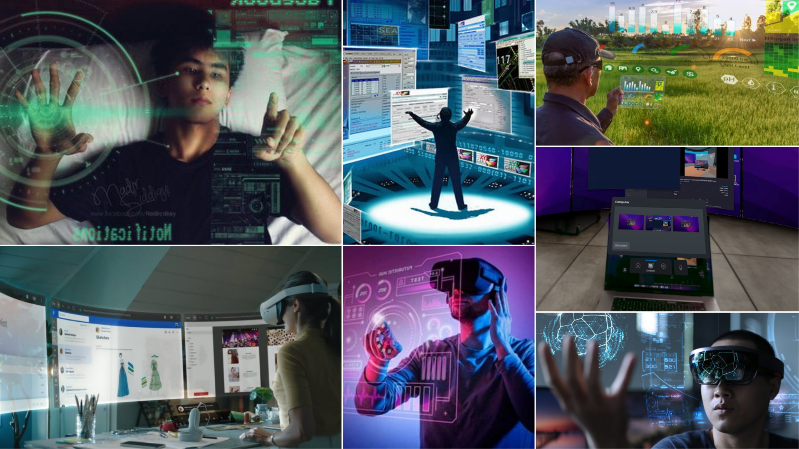
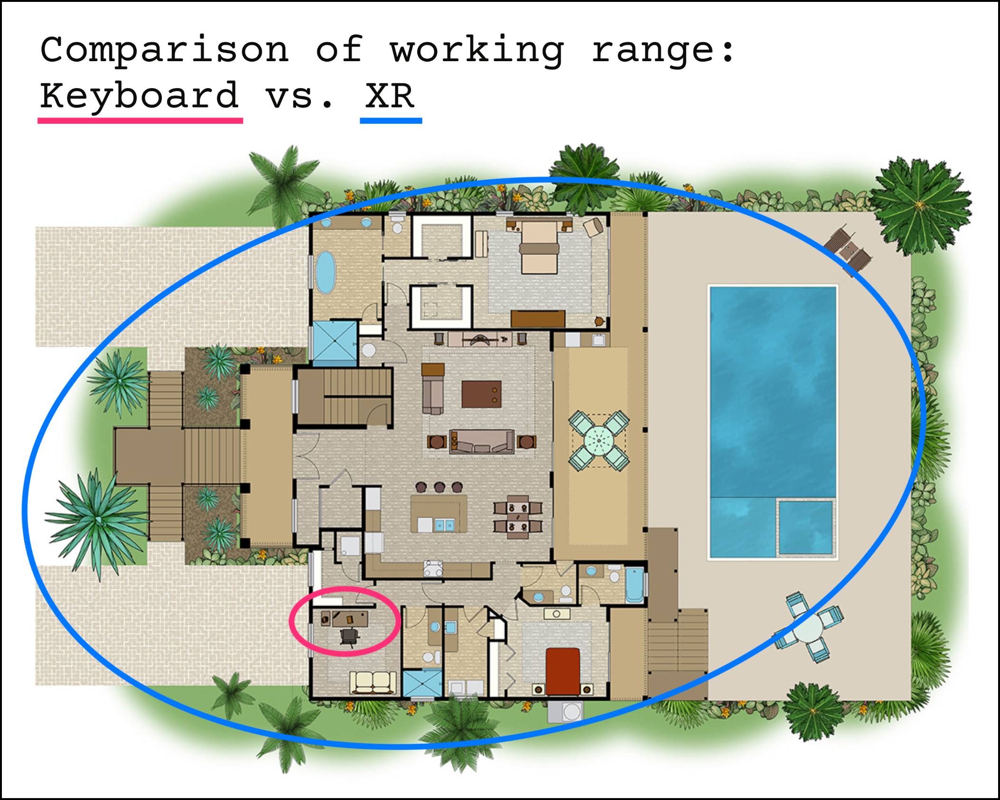
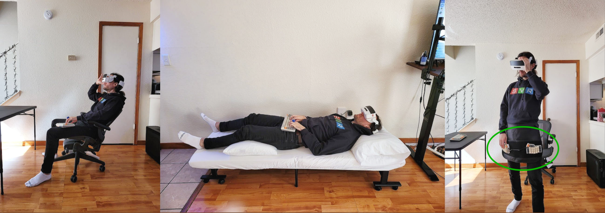
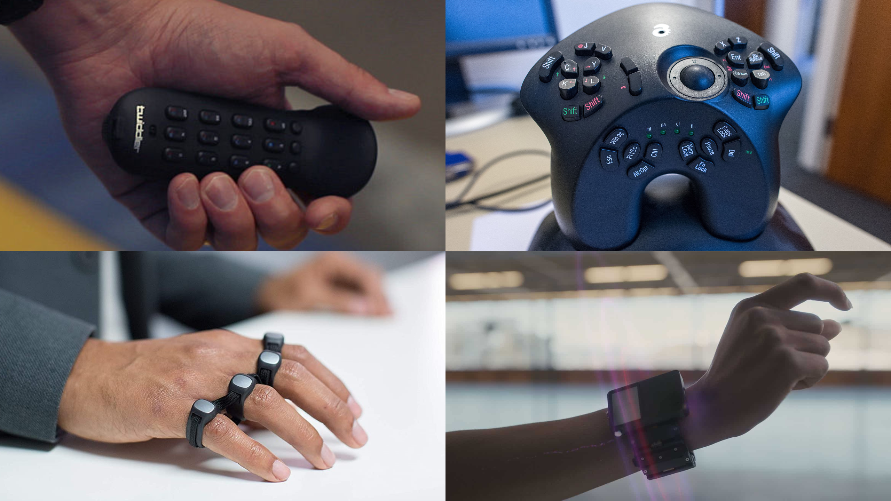

<!-- TODO: put Prev/Next article at top (css?)  -->

# Does XR Need a New Keyboard? 
*The year is 2027. You just got a new XR headset to replace your computer. Unlimited screen real estate in a distraction free realm. Or so you thought.* 

<figure markdown>
  
  <figcaption>Your boundless XR workstation, until...</figcaption>
</figure>

Empowered by this expansive new computing paradigm, you stand up, ~~effortlessly able to continue your efforts~~.

<!-- Here's the problem: your keyboard is stuck on the desk. -->

!!! failure "ERROR"
    Your keyboard is stuck on the desk.

How restraining.

<!-- ## The promise of XR -->

## Problem: The keyboard is holding back XR

<!-- a greater landscape of computing environments -->
XR promises the freedom to take computing anywhere: pace the room, roam out into nature, lie in bed or the comfiest of chairs; your cinematic information interface comes effortlessly with you.

<figure markdown>
  {width=600}
  <figcaption> The promise of XR computing </figcaption>
</figure>
<!-- limitless computing -->

XR "unlocks the map" for computer interfaces— but here's the catch, as soon as you need a keyboard, you're tied to the desk[^1].
Next time you see a concept render of someone orchestrating computational wonders with their mere hands, ask yourself this: when *you* use a computer, would you last a day, let alone an hour, working like this? Or would you want a keyboard?

[^1]: 
    Alternatively you can suffer the following torment.

    <figure markdown> 
      {width=450}
      <figcaption> Current "state of the art" XR keyboard. So slow it's utterly unusable for non-trivial tasks. </figcaption>
    </figure>

<figure markdown>
  {width=600}
  <figcaption> A bottleneck in XR computers: The stationary keyboard </figcaption>
</figure>

Though there are many cases where a touchscreen interface is perfect, for professional or otherwise performant computer use cases —writing documents, emails, or using specialist applications— keyboard presence is completely ubiquitous.
As XR grows to serve these use cases, it shall be strange that a floating 8k monitor comes everywhere with you, when a keyboard, a seemingly simpler device, cannot.

## Solution: XR needs a new keyboard
XR is calling out for a new keyboard, or keyboard-like device, that matches the working range of the headset it will accompany. 

This need is obvious for anyone that *actually tries* to use an XR headset as a computer. 
Take [SimulaVR](https://simulavr.com), a company building the first VR linux workstation. They have predictably run into this problem in practice and improvised a remedy, the "Keyboard Apron".

<figure markdown>
  {width=700}
  <figcaption> SimulaVR in use. From left: sitting away from desk (keyboard not ideal), lying in bed (keyboard not practical), standing (keyboard not possible) hence apron innovation. <a href="https://twitter.com/georgewsinger/status/1507840684556009478?cxt=HHwWjIC-zaPH9uwpAAAA">[source]</a> </figcaption>
</figure>

The Simula Apron is a significant mobility upgrade on the traditional keyboard, but not without flaws.
The arms are stuck in a single non-optimal position, separate from standard VR controllers or gestures, not to mention the apron is sizeable and clunky.
It's a great hacky compromise, but not yet a truly native XR keyboard. 

Elsewhere, the internet reveals a host of previous attempts at mobile keyboards with a wide variation of intriguing features, though none measure up as a ready keyboard replacement for XR. 
There was the 1992-2015 [twiddler](https://twiddler.tekgear.com), a chorded one-hander with fiddly buttons.
The 2005 [AlphaGrip](http://www.alphagrips.com), a game-controller-with-lots-of-extra-keys shaped device.
The 2015—present [Tap Strap](https://www.tapwithus.com), a web of rings which register taps on a surface.
Finally, the 2019 [CTRL-Labs writstband](https://www.curtisbarbre.com/ctrl-kit) (acquired by Meta/Facebook), which aimed to reconstruct hand movements from wrist sensors.
   
<figure markdown>
  {width=600}
  <figcaption> Past wearable keyboards. Clockwise from top left: Twiddler3, AlphaGrip, CRTL-Labs wristband, Tap Strap. </figcaption>
</figure>

Having tested them all, a common problem is bad ergonomics and poor or nonexistent tactile feedback.
None feel satisfying to use the way a mechanical keyboard or good game controller do.
Instead they're varying degrees of uncomfortable, making the experience one of constant frustration.
Another weakness is the keymaps, all are non-standard so the devices have a steep learning curve, weeks if not months of painstaking training. 
Additionally, all result in a considerably lower WPM than a standard keyboard. That's a bitter pill for all and a dealbreaker for many, probably most.

In contrast then, a viable XR keyboard should have comfortable ergonomics and tactile feedback, be fast to pick up for those coming from a standard keyboard, and have a fast typing speed.

<!-- Note: the touchscreen keyboard found on mobile phones is no good here because...  -->

<!-- a better solutions might now be available due to consumer 3D printing (better fit ergonomics) and the rise of XR (impetus) -->

## Conclusion
Bringing together our key findings:

1. The standard keyboard is not suitable for XR due to its lack of mobility.
2. It is a convenient fiction that computers will be entirely, or even largely, operable without keyboards in the near future.

We conclude that XR computing is hamstrung by the lack of a viable mobile keyboard. So yes, XR is going to need a new keyboard.
What exact form this will take is not yet clear.
For example, exactly how much will such a device resemble the current keyboard?
What we have discovered is that wearable computers need wearable input.

<!-- What we do know is that if you want a mobile computer, then your going to want mobile input.  -->

<!-- I want an XR computer and so I want this. -->
<!-- If no one else is going to build this, I might just do it myself. -->

<!-- # NOTES -->

<!-- ## BIG QUOTE  -->
<!-- 
 -->
<!--    -->
<!--     <i>"This is bigger and centred text, lets put a nice little quote here for our lovely readers. But what about my magic bean and line overflow?"</i> -->
<!--    -->
<!-- 
 -->

<!-- ## Why is nobody building this
- For the size of investment going into VR, I find it amazing how little attention there is on this issue
- lack of foresight
- if our thesis is true, what systematic forces might lead the market to overlook this
- Why haven't the big tech companies developing XR technology been working on wearable keyboard input
- XR evolves into a keyboardless computing environment 
- iPadification Fallacy -> undervalue the keyboard
- lazy option, new hardware/devoces is hard
- Meta, currently the biggest player in this space, is marketing XR foremostly as a social-interactive entertainment metaverse, generally devoid of 1st class desktop functionality (and hence keyboard input)-- and many others are following suit.
- text input and manipulation is core to human communication with computers.
- Desktops are like western cooking, the phone is like japanese cooking, everything is cut for you but that doesnt mean they dont have knifes in japan.
- the parable of the fool in the japanese restaurant
- A fool might be lead to believe there are no knifes in japan. go to any resturant and find that the food is already in bitesize chunks. the fools concludes that knifes are not needed in cooking.
- but ask any chef in japan or the world, if they had to cook with only one tool from their kitchen, of course they take their chefs knife.
- Similarly, A fool might use a mobile phone and be conviced that in the future, computers do not need physical keyboards. 
- Mobile computing is like japanese food already prepared into easy bitesize chunks-- all the keyboards are in the kitchen
- all the apps are written with a keyboard.
- in XR the kitchen and the eating will be merged, 
 -->

<!-- ## the need for keyboards
- a need for what the keyboard provides: fast text and symbolic input, cannot be made be redundant in the XR computing platform, certainly not in the foreseeable future.
- People will continue to want to edit documents, emails, spreadsheets,kj code and use keyboard shortcuts-- task which are clunky using alternatives such as touchscreens or voice assistants.
-->
