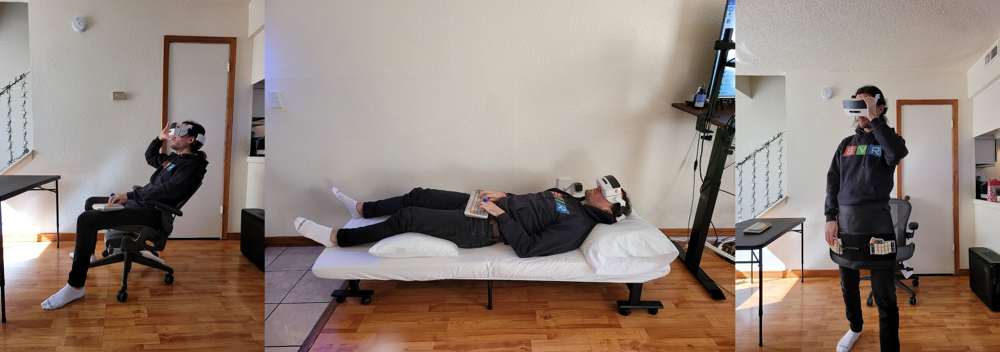

<!-- TODO: put Prev/Next article at top (css?)  -->

# Does XR Need a New Keyboard? 
*The year is 2027. You just got a new XR headset to replace your computer. Unlimited screen real estate in a distraction free realm. Or so you thought.* 

<figure markdown>
  
  <figcaption>Your boundless XR workstation, until...</figcaption>
</figure>

Empowered by this expansive new computing paradigm, you stand up, ~~effortlessly able to continue your efforts~~.

<!-- Here's the problem: your keyboard is stuck on the desk. -->

!!! failure "ERROR"
    Your keyboard is stuck on the desk.

How restraining.

<!-- ## ? The promise of XR -->
<!-- Benefits of XR HERE? -->

## Problem: The keyboard restricts XR
<!-- ALT: ## The bottleneck for XR computers  -->

<!-- a greater landscape of computing environments -->
XR promises the freedom to take computing anywhere: pace the room, roam out into nature, lie in bed or the comfiest of chairs; your cinematic information interface comes effortlessly with you.

<figure markdown>
  {width=600}
  <figcaption> The promise of XR computing </figcaption>
</figure>
<!-- limitless computing -->

XR "unlocks the map" for computer interfaces— but here's the catch, as soon as you need a keyboard, you're tied to the desk[^1].
Next time you see a concept render of someone orchestrating an complex XR interface with their mere hands, ask yourself this: when *you* use a computer, would you last a day, let alone an hour, working like this? Or would you want a keyboard?

[^1]: 
    Alternatively you can suffer the following torment.

    <figure markdown> 
      {width=450}
      <figcaption> Current "state of the art" XR keyboard. So slow it's utterly unusable for non-trivial tasks. </figcaption>
    </figure>

<figure markdown>
  {width=600}
  <figcaption> A bottleneck in XR computers: The stationary keyboard. </figcaption>
</figure>

Though there are many cases where a touchscreen interface is perfect, for professional or otherwise performant computer use cases —writing documents, emails, or using specialist applications— keyboard presence is completely ubiquitous.
As XR grows to serve these use cases, it shall be strange that a floating 8k monitor comes everywhere with you, when a keyboard, a seemingly simpler device, cannot.

<!-- With XR already beginning to serve these use cases, the sole bottle neck restricting movement and tying you to the desk is the keyboard. -->

<!-- As XR grows to serve these use cases, ... -->
<!-- the only thing holding you back from fluidity in this extended computational world.  -->
<!-- they keyboard will be  -->

<!-- END THE ARTICLE HERE?! -->

<!-- Worse, its likely that these are the use cases that will *need* XR. -->

 
<!-- 
 -->
<!--    -->
<!--     <i>"This is bigger and centred text, lets put a nice little quote here for our lovely readers. But what about my magic bean and line overflow?"</i> -->
<!--    -->
<!-- 
 -->

<!-- Movement is not some future luxury, the human body is designed to be in constant motion and  -->

<!-- <figure markdown> -->
<!--   {width=600} -->
<!--   <figcaption> Evolution of a human's working posture. Can this be reversed? </figcaption> -->
<!-- </figure> -->

<!-- The computer desk is linked with  -->

<!-- and too much time sitting at a computer desk leads to predictable deterioration in posture, mobility, mortality and cognition; the shocking extent of which we cover in our [previous post in the series]:  -->

<!-- "As many as 60% of computer-using professionals are expected to suffer debilitating RSI at some point their career (CITE) ...  one study suggested that sitting for as little as 3 hours a day reduced average life expectancy by 2 years" -->
<!-- it is a cornerstone of health and cognition. -->

<!-- In opposition, are the [extraordinary physical and cognitive benefits of movement and the outdoors]. -->

<!-- ??? note "A hope of XR: A return to locomotion" -->

<!--     <\!-- MAYBE FIGURE -\-> -->

<!--     <\!-- posture, mobility, mortality and cognition -\-> -->
<!--     That you assume sitting all day at a computer desk is satisfactory, is an exemplar specimen of status quo bias. -->
<!--     Given free realm to move ones arms, stand up, and wander around (whilst maintaining working capability), you will, --just as humans have done in the past-- because that's our nature. -->

<!--     Against the grain of human nature, -->
<!--     the stationary desk is a direct product of the stationary computer and its towering civilisational function. -->
<!--     As the opportunity presents itself for the computer to become wearable, you would be mistaken for thinking this inconsequential. -->

<!--     Contrary to the fear that VR will take us away from the real world, a major hope of XR computing is that it will return us to the *locomotion lifestyle* of our hunter-gatherer heritance: increasing time spent outdoors and moving our body in natural ways. -->
<!--     As long as the stationary keyboard persists, we remain tied to the desk and this freedom cannot be fully realised. -->

<!-- ## Movement and the stationary desk -->
<!-- ## The stationary desk and the human condition -->
<!-- ## human nature and the stationary desk -->

## Solution: XR needs a new keyboard
XR is calling out for a new keyboard, or keyboard-like device, that matches the working range of the headset it will accompany. 

This need is obvious for anyone that *actually tries* to use an XR headset as a computer. 
Take [SimulaVR](https://simulavr.com), a company building the first VR linux workstation. They have predictably run into this problem in practice and improvised a remedy, the "Keyboard Apron".

<!-- TODO: simplify the captiona nd make the point keyboard -->
<!-- "neither keybaord nor apron is ideal in these scenarios" -->
<figure markdown>
  {width=700}
  <figcaption> SimulaVR in use. From left: sitting away from desk (keyboard not ideal), lying in bed (keyboard not practical), standing (keyboard not possible) hence apron innovation. <a href="https://twitter.com/georgewsinger/status/1507840684556009478?cxt=HHwWjIC-zaPH9uwpAAAA">[source]</a> </figcaption>
</figure>

The Simula Apron is a significant mobility upgrade on the traditional keyboard, but not without flaws.
The arms are stuck in a single non-optimal position, separate from standard VR controllers or gestures, not to mention the apron is sizeable and clunky.
It's a great hacky compromise, but not yet a truly native XR keyboard. 

Elsewhere, the internet revealed a zoo of past attempts at wearable keyboards, none of which quite seemed a viable keyboard replacement for XR.
There was the 1992-2015 [twiddler](https://twiddler.tekgear.com), a chorded one-hander with fiddly buttons.
The 2005 [AlphaGrip](http://www.alphagrips.com), a game-controller shaped device with many extra buttons.
The 2015—present [Tap Strap](https://www.tapwithus.com), that webs rings across the fingers which register taps.
Finally, the 2019 [CTRL-Labs writstband](https://www.curtisbarbre.com/ctrl-kit) (acquired by Meta/Facebook), which aimed to reconstruct hand movements from sensors on the wrist.
   
<figure markdown>
  {width=600}
  <figcaption> Past wearable keyboards. Clockwise from top left: Twiddler3, AlphaGrip, CRTL-Labs wristband, Tap Strap. </figcaption>
</figure>

Having tested them all, common weaknesses are uncomfortable ergonomics and bad or nonexistent tactile feedback. 
Another problem is the keymaps are non-standard so all the devices have a steep learning curve, weeks if not months of painstaking training. 
Further, all result in a considerably lower WPM than a standard keyboard. That's a bitter pill for all and a dealbreaker for many, if not most.

In contrast then, a viable XR keyboard should have comfortable ergonomics and tactile feedback, a low learning curve for those familiar with a standard QWERTY layout, and high achievable WPM.

<!-- a better solutions might now be available due to consumer 3D printing (better fit ergonomics) and the rise of XR (impetus) -->

## Outcome
We conclude that,
(1) the standard keyboard is not suitable for XR due to its lack of mobility,
(2) it is a convenient fiction that computers will be entirely, or even largely, operable without keyboards in the near future,
(3) hence, XR computers are hamstrung by the lack of a viable keyboard, 
and so finally, (4) yes, XR needs a new keyboard— wearable computers need wearable input.

What exact form this will take is not yet clear, say for example, how much will such a device resemble the current keyboard?
What I do know is that I want an XR computer and so I want this.
If no one else is going to build this, I might just do it myself.

<!-- # NOTES -->

<!-- ## Why is nobody building this
- For the size of investment going into VR, I find it amazing how little attention there is on this issue
- lack of foresight
- if our thesis is true, what systematic forces might lead the market to overlook this
- Why haven't the big tech companies developing XR technology been working on wearable keyboard input
- XR evolves into a keyboardless computing environment 
- iPadification Fallacy -> undervalue the keyboard
- lazy option, new hardware/devoces is hard
- Meta, currently the biggest player in this space, is marketing XR foremostly as a social-interactive entertainment metaverse, generally devoid of 1st class desktop functionality (and hence keyboard input)-- and many others are following suit.
- text input and manipulation is core to human communication with computers.
- Desktops are like western cooking, the phone is like japanese cooking, everything is cut for you but that doesnt mean they dont have knifes in japan.
- the parable of the fool in the japanese restaurant
- A fool might be lead to believe there are no knifes in japan. go to any resturant and find that the food is already in bitesize chunks. the fools concludes that knifes are not needed in cooking.
- but ask any chef in japan or the world, if they had to cook with only one tool from their kitchen, of course they take their chefs knife.
- Similarly, A fool might use a mobile phone and be conviced that in the future, computers do not need physical keyboards. 
- Mobile computing is like japanese food already prepared into easy bitesize chunks-- all the keyboards are in the kitchen
- all the apps are written with a keyboard.
- in XR the kitchen and the eating will be merged, 
 -->

<!-- ## the need for keyboards
- a need for what the keyboard provides: fast text and symbolic input, cannot be made be redundant in the XR computing platform, certainly not in the foreseeable future.
- People will continue to want to edit documents, emails, spreadsheets,kj code and use keyboard shortcuts-- task which are clunky using alternatives such as touchscreens or voice assistants.
-->
