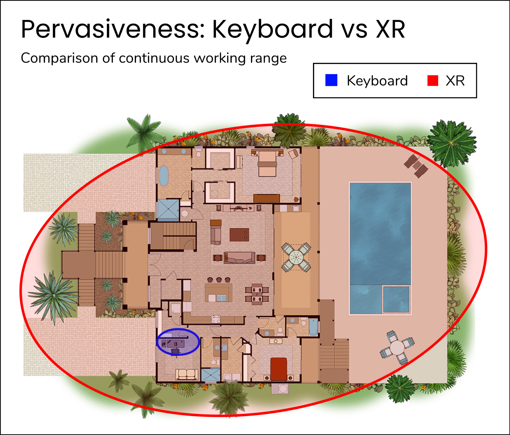
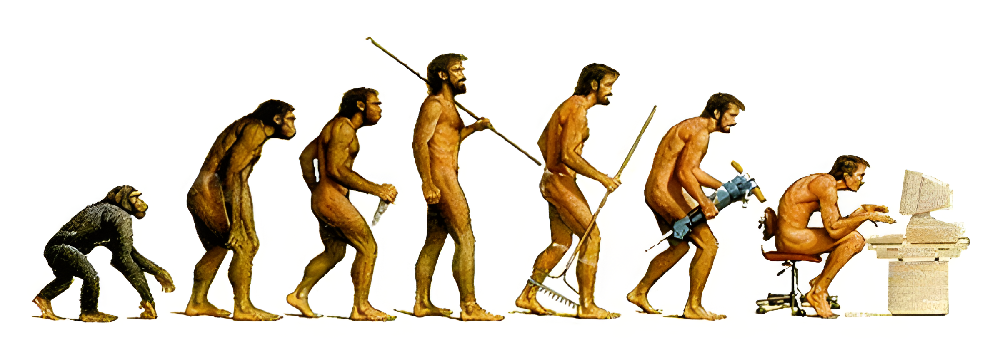
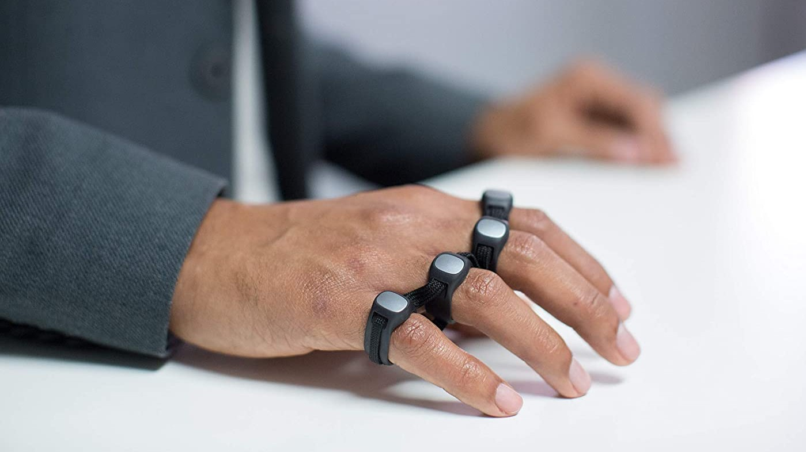
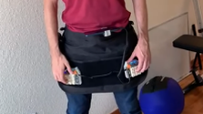
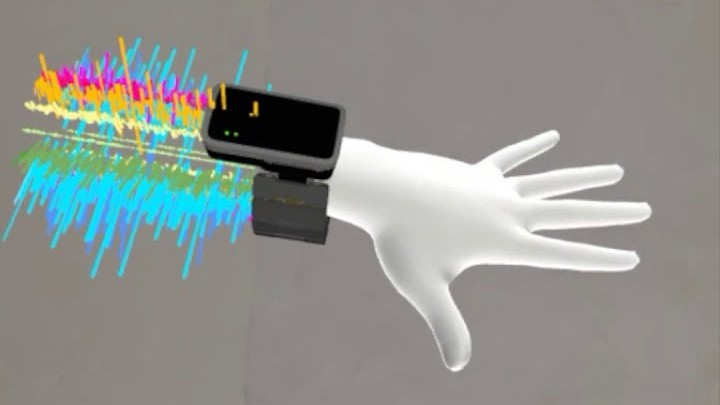

<!-- 
TODO:
  - [ ] get some fat statistics in
  - [ ] remove all bloat
  
NOTES:
  -
-->

# [DRAFT] The Achilles Heel of XR Computers
<!-- # Does XR need a new keyboard? -->
<!-- ALT: XR needs a [native|different] keybaord -->
<!-- The native keyboard for XR -->

<!-- ## Hook -->
The year is 2024. You just got a new VR/AR headset to replace your computer. Unlimited screen real estate in a distraction free paradise.
Exciting times.
Praise be to Zuck.

<figure markdown>
  
  <figcaption>Boundless XR workstation, until...</figcaption>
</figure>

Free from the bondage of the desk, you get up for a wander, ~~effortlessly able to continue your work~~. 

!!! failure "Problem"

    Your keyboard is stuck on the desk.

How restraining.

<!-- MAYBE: straight in with the problem -->
 
## Problem: Stationary keyboards restrict XR
<!-- ALT: ## Problem: Stationary keyboards [ruin|limit|restict] XR -->
<!-- SUMMARY
[x] 1. computer -> keybaord
[x] 2. keyboard -> desk (flat stationary surface)
  [ ] a) desk -> unnatural posture
[ ] 3. XR -> super-(desk mobility)
[ ] 4. Keyboard = XR bottleneck 
-->

<!-- Many computer tasks require a keyboard.  -->
<!-- In turn, a keyboard tends to require a flat and stationary surface (a desk). -->
<!-- But  -->
XR is a fundamentally more *pervasive* computing environment than the keyboard operated desktop: yes, you can sit at a desk, but you can also use a VR/AR headset almost anywhere.
Pace the room, stroll in nature, lie in bed or the comfiest of chairs-- all effortlessly bringing your infinite interface with you.

<!-- TODO: wrap text round figure -->
<figure markdown>
  {width=500}
  <figcaption>Holding back XR: The stationary keyboard </figcaption>
</figure>

Given free realm, no human will choose to sit upright at a desk all day, arms extended like a meerkat, waiting eagerly to develop some Repetitive Strain Injury.
As soon as humans can freely move their arms, stand up, and wander around (whilst maintaining their working capability), they will-- because that's our evolutionary wiring.
The keyboard will soon (obviously) be the bottleneck withholding this expanded landscape of computing.[^1]

[^1]: Note, this is not a problem for the mouse which translates resonably well to portable VR controllers.

<!-- - A major workflow is restricted -->
<!-- The keyboard is a relic of the desktop computing paradigm, it is stationary only because the desktop was itself so. -->

<!-- The solely stationary workspace is a result of the contratints of technology, first paper and writing, then large computers -->

??? note "A promise of XR: return of the locomotion lifestyle"

    <figure markdown>
      {width=600}
      <figcaption>Evolution of Posture</figcaption>
    </figure>

    A major hope of XR computing is that it would free us from the sedentary desk, back to the locomotion lifestyle of our hunter-gatherer heritance, increasing time spent; outside and moving our body in natural ways.
    But as long as the stationary keyboard persists, we remain tied to the desk and this freedom cannot be fully realised.

<!-- ## Why we need the keyboard -->
<!-- We favour keyboards for desktop work because of their ... input speed, tactile feedback, symbolic ... -->

## Solution: XR needs a new keyboard
How does this problem get resolved?
We see three possibilities: 

1. It doesn't: keyboard usage restrains XR mobility indefinitely. 
3. XR evolves into a keyboardless computing environment.
2. We get a new, XR friendly, portable/wearable keyboard.

(1) [as laid out](#problem-stationary-keyboards-restrict-xr) is unstable, enough people will want (3).

(2) is patently naive, a need for what the keyboard provides: fast text and symbolic input, cannot be made be redundant in the successor to desktop computing.
People will continue to want to edit documents, emails, spreadsheets, code and use keyboard shortcuts-- task which are clunky using alternatives such as touchscreens or voice assistants. 
  
(3) is ideal, solves the problem and is almost certainly what we want.

Interestingly, leading XR platforms do not seem to be urgently pursuing (3).
Meta, currently the biggest player in this space, is marketing XR foremostly as a social-interactive entertainment metaverse, generally devoid of 1st class desktop functionality (and hence keyboard input)-- and many others are following suit.

## What is currently available?
<!-- Some early attempt s have been made to bring keybaord functionality to XR along with some possible... -->

| Name               | Image                             | Notes                                                                                                                          |
|--------------------|-----------------------------------|--------------------------------------------------------------------------------------------------------------------------------|
| Standard keyboard  |                                   | The problem. Not suitable for XR computing.                                                                                                                               |
| On screen keyboard |     | The current "state of the art". Completely unusable for serious work. Swipe might be slightly better.                          |
| Twiddler           |       |                                                                                                                                |
| Tap Strap          |      |                                                                                                                                |
| Keyboard Apron     |  | Simple hack in the right direction using split ergonomic keyboard. However movement is still limited and must switch between this and handheld controllers.                  |
| EMG wristband      |   | Experimental input device not yet functional. Unlikely to be ready[^2] before XR takes off as a mainstream computing platform. |
| Typeware ?

[^2]: cite zuckerberg article 5 years away 5 years ago, now 5 years away.

## Why is no one building this?

<!-- Lazily assuming (1) will be enough or that (2) is possible. -->
<!-- instead of developing new technology -->

<!-- - Meta is highly influential -->
<!-- - iPadification Fallacy -->
<!-- - lazy option, new hardware/devoces is hard -->

Some rudimentary attempts have been made (SimulaVR keyboard aperon) ... 

<!-- - lazy solutions -->
<!-- - undervalue the keyboard -->
<!-- - don't really believe it will replace the desktop  -->
<!-- - lack of foresight? -->

<!-- have tended to underestimate the value proposition of (2), lazily assuming the suboptimal solutions (1) and/or (3). -->

<!-- This is one face of the broader iPadification fallacy, responsible for the in-vogue attempt to build XR computers devoid of serious symbolic input, instead with only mobile-esque pointing devices. -->

<!-- - ... the in-vogue (narrower) outlook of XR as a social-interactive entertainment metaverse of 3D virtual objects -->

<!-- What is crazy is that despite this, (2) seems currently be the assumed logic of XR computing platforms under development  -->

<!-- text and symbolic input/manipulation is core to human communication with computers.  -->

<!-- It is however worth noting because it currently seems to be the assumed logic of existing XR technologies.  -->

## Principles for building a new XR keyboard
- MAYBE TODO

**Twiddler** 
: Poor ergonomics and keymap.

## Conclusion
XR needs a portable new keyboard.
What form this will takes is not clear, particularly how much such a device will resemble the current keyboard.
<!-- If you're not careful, I might just build one.  -->

<!-- - The time is now.. -->

<!-- Pick your fighter... -->

<!-- === "Ditch the keyboard" -->

<!--     * on screen keyboard -->
<!--     * menus + voice + ai -->

<!--     <figure markdown> -->
<!--       {width=300} -->
<!--       <figcaption>VR keyboard</figcaption> -->
<!--     </figure> -->

<!-- === "EMG wrsitband" -->

<!--     1. Sed sagittis eleifend rutrum -->
<!--     2. Donec vitae suscipit est -->
<!--     3. Nulla tempor lobortis orci -->

<!-- === "Keyboard for XR" -->

<!-- ## Benefits -->
<!-- <\!-- ? MOVE: the promise of XR -\-> -->
<!-- - return outside -->
<!-- - prevent RSI -->
<!-- - embody cognition (move = think) -->
<!-- -   -->

<!-- ## Misconception: Point and click will be enough -->

<!-- Stockholm syndrome for the desk -->
<!-- ## (Bonus) Why nobody is building this  -->

