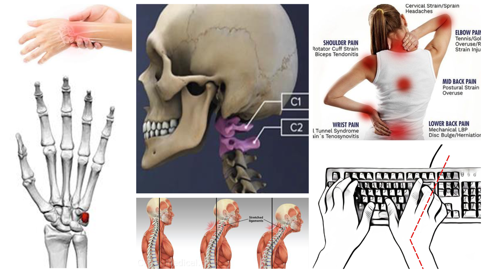
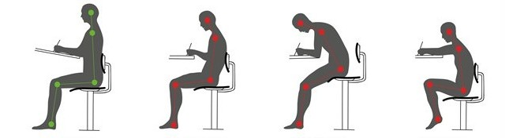
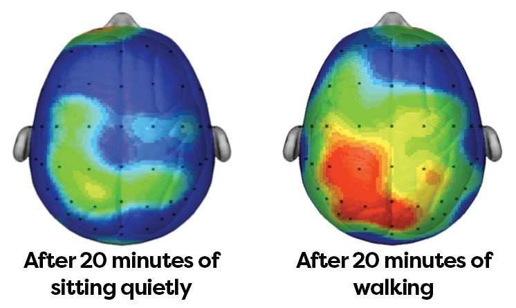

# Why XR Headsets are The Future of Work™ 
<!-- ALT: Why XR Headsets are the Future of Computing -->
<!-- XR Headsets: Coming soon to a future near you! -->
<!-- The Impending Revolution: XR headsets -->

## The harms of the computer desk
Contrasting XR's promise of liberating movement are the significant harms of spending too much time at a computer desk-- a condition we'll refer to as *homo deskalldayos* (short: *homo deskos*).
This group includes the worlds 1+ billion professional workforce (roughly half of all adults in developed countries), and caries serious, often overlooked, health risks.

<!-- who are ingrained to spending many hours at a stationary computer desk, conditioned to the universality of the serious health risks.
<!-- to risks to mobility, posture and chronic disease.  -->
<!-- normalise the adverse health effects as expected working conditions. -->

<figure markdown>
  {width=550}
  <figcaption> Posture and mobility deterioration associated with the computer desk </figcaption>
</figure>

Homo deskos commonly suffers characteristic posture and mobility deterioration.
The human body is designed for regular movement and so prolonged sitting leads to poor posture as it overburdens the static load on the musculoskeletal system; particularly straining the neck, back and spine-- causing pain.
Moreover, the craned-neck posture and unnatural hand positioning/movement encouraged by computer use worsens this situation further.
Neck, shoulder, back, elbow, wrist and finger damage are all endemic amongst computer users.
Particularly common is Repetitive Strain Injury (RSI), which occurs when tendon tissue slowly degenerates as a result of constant stress or strain.
As many as 60% of computer-using professionals are expected to suffer debilitating RSI at some point their career (CITE).
<!-- "hunched over" -->

Prolonged sitting also prevents effective circulation of blood throughout the body.
This is one reason people with high levels of sedentary time have been found to have a 112% increased risk of diabetes, 147% increased risk of cardiovascular death, and 49% increased risk of all-cause mortality.
Not coincidentally, sitting is linked to increased blood pressure, increased body fat, increased cholesterol and Deep Vein Thrombosis (DVT) (blood clots). 
One study suggested that sitting for as little as 3 hours a day reduced average life expectancy by 2 years (CITE).
<!-- sitting increases the chance of early death from heart disease, cancer and stroke  -->
<!-- Research strongly links homo deskos' sedentary lifestyle (sitting for long periods) to a slew of chronic health conditions. -->

Sedentary lifestyles also effect balance of mind and cognition, with sitting being linked to higher rates of depression, anxiety and even dementia (CITE). 
Continuous sitting is also know to have an impact on energy levels and creative thinking.

??? note "A shallow solution"

    As a coping mechanism, homo deskos worship an icon deity known as *homo deskos uprightos*, an idealised form of desk posture that is genreally unattainble for extended periods of time, and less repairing that sometimes claimed. 

    <figure markdown>
      {width=550}
      <figcaption> From left: homo deskos uprightos, homo neckachei, homo 
      shouderstrainos and homo tightlowerbackeniki </figcaption>
    </figure>

Given a free life, no human would choose to sit upright all day, arms extended like a meerkat, waiting eagerly to develop diabetes and RSI.
But like miners and hard labours before them, such is the economic dependency on homo deskalldayos, that collective society can seldom afford to think too radically of their healing.
Yet, if we soon push through the technological change to liberate the computer from the confines of the desk...

## The benefits of movement
Most of us don't need science to know that moving around, particularly outside is good for us, we are natrually drawn to it as a means of .....

Even so, scientific findings can show supprising effects

...

1. Physical 

2. Cognitive
    - you natrually intuit this
    - mental health
    - creativity
    - many famous people .. (thesis)

<figure markdown>
  {width=550}
  <figcaption> Cognitive effect of 20 minuites walking in children </figcaption>
</figure>

... study showed improved reading comprehension, spelling and arithmetic after walking. (increased attention and academic performace)

<!-- NOTES -->

<!-- ## THE LOCOMOTION LIFESTYLE -->
<!--     Contrary to the fear that VR will take us away from the real world, a major hope of XR computing is that it will return us to the *locomotion lifestyle* of our hunter-gatherer heritance: increasing time spent outdoors and moving our body in natural ways. -->
